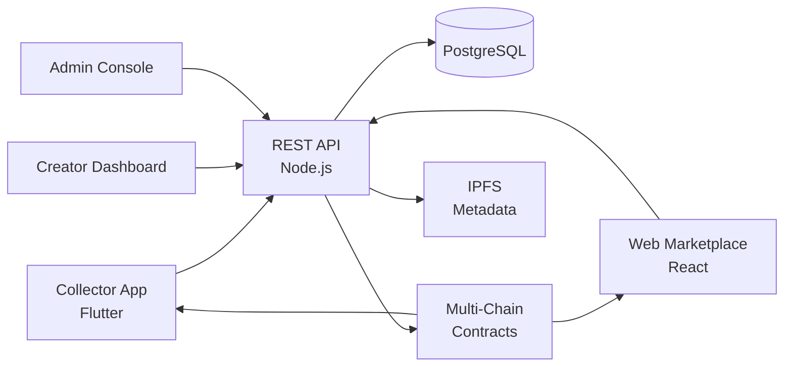

# Rarible Clone — White-Label NFT Marketplace Platform by Miracuves

**MXNFT** is a production-ready, white-label Rarible clone: a complete NFT marketplace with lazy minting, multi-chain, and royalty engine — delivered with **100% source code ownership** in **6 working days**.

> 🖼️ **See it running before you talk to anyone.** Live collector app, creator dashboard, and admin console — demo credentials are printed on the [solution page](https://miracuves.com/rarible-clone#demo). No sales call required.

---

## 🚀 Live Demos

| Environment | URL | What you can test |
|---|---|---|
| 📱 Collector App | [mas.mimeld.com](https://mas.mimeld.com) | Browse, mint, buy, sell, bid, track portfolio |
| 🌐 Web Marketplace | [mxnft.mimeld.com](https://mxnft.mimeld.com) | Full marketplace in the browser |
| 🎨 Creator Dashboard | [Solution page → Demo](https://miracuves.com/rarible-clone#demo) | Collections, drops, royalties, analytics |
| 🛠️ Admin Console | [Solution page → Demo](https://miracuves.com/rarible-clone#demo) | Users, collections, royalties, disputes |

Demo credentials for all environments: **[miracuves.com/rarible-clone → Demo section](https://miracuves.com/rarible-clone/#demo)**

---

## ✨ What Makes This Rarible Clone Different

Most NFT scripts stop at "mint + list." This platform ships with the features that actually run an NFT *marketplace*:

- **Lazy Minting Native** — creators set up collections; minting happens on first purchase — same gas-saving pattern OpenSea pioneered
- **Multi-Chain Marketplace** — Ethereum, Polygon, Solana, Base, BSC — same UI, chain-aware contracts
- **Royalty Engine** — creator + collaborator + platform royalties — supports the EIP-2981 standard and per-collection overrides
- **Auction + Buy Now** — timed auctions (English / Dutch / reserve), fixed-price, bundle sales — same modes Christie's and Sotheby's run
- **Rarity & Analytics Tool** — attribute-based rarity rankings within 1 minute of metadata upload — what collectors actually use

## 📦 Core Features

**Collector:** browse collections · mint · buy · bid · make offers · track portfolio · rarity tool · follow creators · multi-currency

**Creator:** collection builder · lazy minting · royalty settings · drop scheduler · analytics · payout requests · verification badge

**Admin:** collection approvals · royalty engine · fee management · dispute resolution · compliance reporting · analytics

## 🏗️ Architecture

**Stack:** Node.js backend · Solidity smart contracts (audit-ready) · React/Next.js for web · React Native / Flutter for mobile · IPFS for metadata · TheGraph for indexing · crypto-native; ETH, MATIC, SOL, USDC support

## 📋 What’s Included

- ✅ Full source code — backend, web, mobile apps, panels (no encryption, no license locks)
- ✅ Deployment to your servers & app store submission assistance
- ✅ Your branding — white-label rename, logo, colors, domain
- ✅ 60 days post-launch support + 12 months of free updates
- ✅ Documentation & handover

**Pricing:** from **$6,999**, transparent on the [solution page](https://miracuves.com/rarible-clone/#pricing) — no "contact us for quote" games.

## 🆚 Why Not Build From Scratch?

Custom NFT marketplaces run $100k–$500k and 4–9 months. A proven white-label base gets you to market in 6 working days for a fraction of that, with your budget preserved for audit fees and creator outreach.

## 📚 Resources

- 📖 [Rarible Clone — Full Solution Page](https://miracuves.com/rarible-clone) (features, pricing, demos, FAQ)
- 💰 [How Much Does an NFT Marketplace Cost in 2026?](https://miracuves.com/rarible-clone#pricing) pricing breakdown & what's included
- 📝 [Best Rarible Clone Script in 2026](https://miracuves.com/rarible-clone/blog/) features, pricing & launch guide
- 🧠 [Lazy Minting: Why It Matters for NFT Marketplaces](https://miracuves.com/rarible-clone/blog/) gas savings, EIP standards
- ✅ [Miracuves Facts & Claims Ledger](https://miracuves.com/rarible-clone/facts/) every claim we make, verified

## 🏢 About Miracuves

[Miracuves Solutions](https://miracuves.com) builds white-label clone apps and custom software from Mumbai, India — 90+ ready-made solutions, live demos for every product, transparent pricing, and delivery in 6 working days. Operating since 2010.

**Talk to us:** [WhatsApp](https://wa.me/919830009649) · [Schedule a consultation](https://miracuves.com/schedule-consultation/) · [miracuves.com](https://miracuves.com)

---

### ⚠️ Note on This Repository

This repository is a product overview. The full source code is delivered to clients on purchase — see [what’s included](https://miracuves.com/rarible-clone/#included). For a hands-on evaluation, use the live demos above; credentials are public on the solution page.

*Keywords: rarible clone, rarible clone script, NFT marketplace, white label NFT, multi-chain, lazy minting, Flutter NFT app, Node.js NFT*

---

<!--
══════════════════════════════════════════════════
TEMPLATE VARIABLE KEY — auto-generated from Netflix-Clone pattern
══════════════════════════════════════════════════
{APP_NAME}        Rarible Clone
{MX_NAME}         MXNFT
{CATEGORY}        NFT Marketplace Platform
{DEMO_WEB}        mxnft.mimeld.com
{PRICE}           $6,999
{SLUG}            rarible-clone
{SOLUTION_URL}    https://miracuves.com/rarible-clone/
{VERTICAL}        nft_marketplace

See /tmp/verticals/nft_marketplace.txt for the vertical config used to generate this README.
══════════════════════════════════════════════════
-->